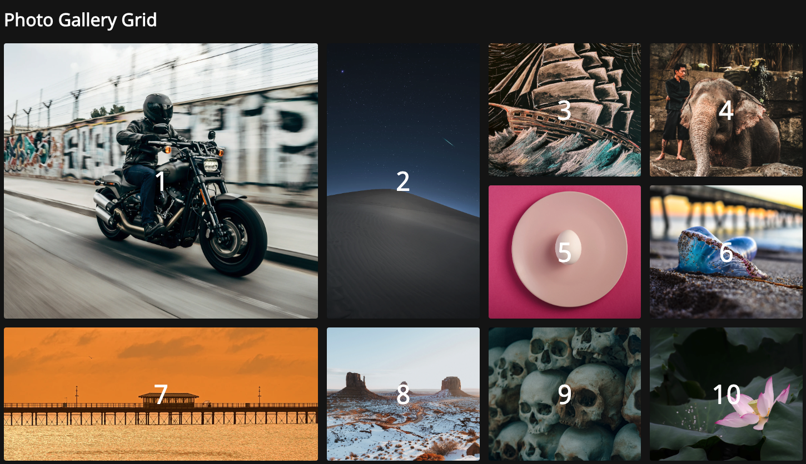
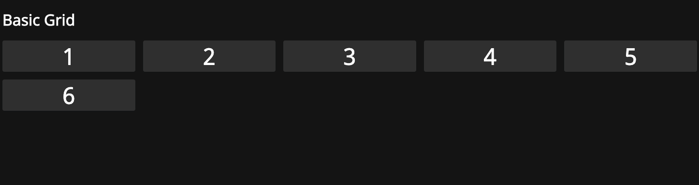

# CSS Grid Layouts

Examples of css grid layout using:

```css
grid-template-columns: repeat(auto-fit, minmax(240px, 1fr));

grid-auto-rows: 240px;

grid-row: span 2 / auto;

grid-column: span 2 / auto;
```

## Photo Grid



## Basic Grid



## Usage

Use VS Code extension [live server](https://marketplace.visualstudio.com/items?itemName=ritwickdey.LiveServer) to show gird layouts

## References

- [The Joy of CSS Grid - Build 3 Beautifully Simple Responsive Layouts (Video)](https://www.youtube.com/watch?v=705XCEruZFs&t=3s)
- [Mozilla CSS Grid Layout (Docs)](https://developer.mozilla.org/en-US/docs/Web/CSS/CSS_Grid_Layout)
- [A Complete Guide to Grid](https://css-tricks.com/snippets/css/complete-guide-grid/)
